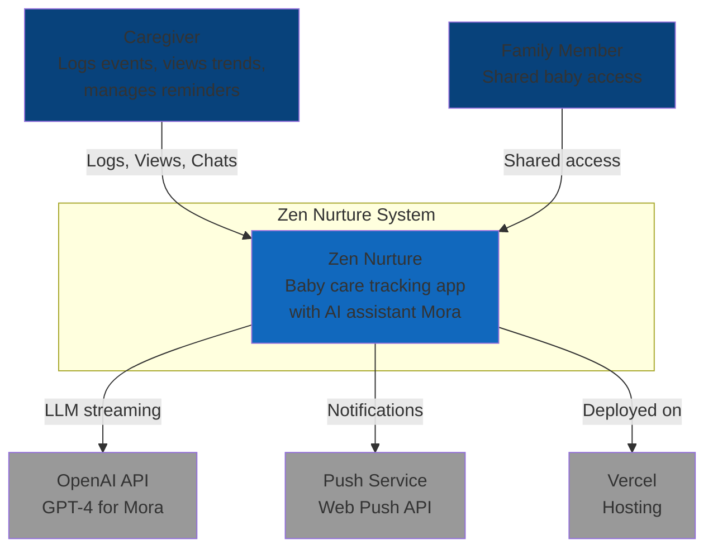
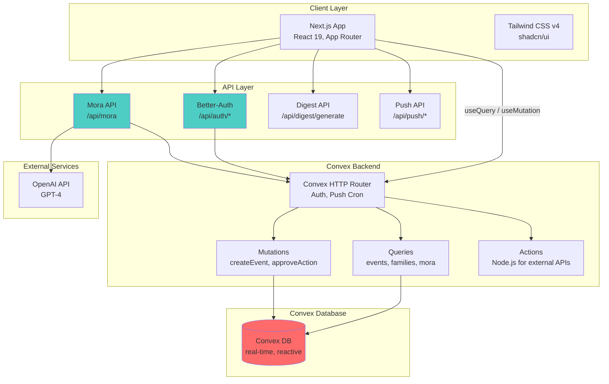
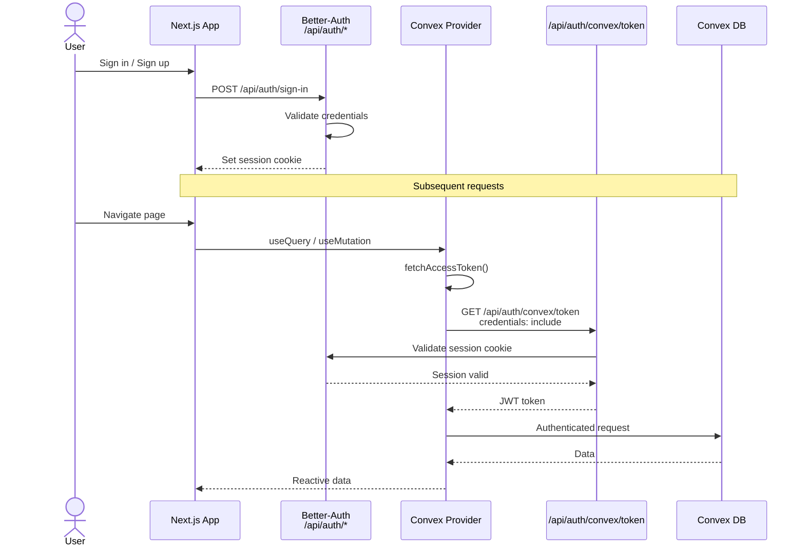
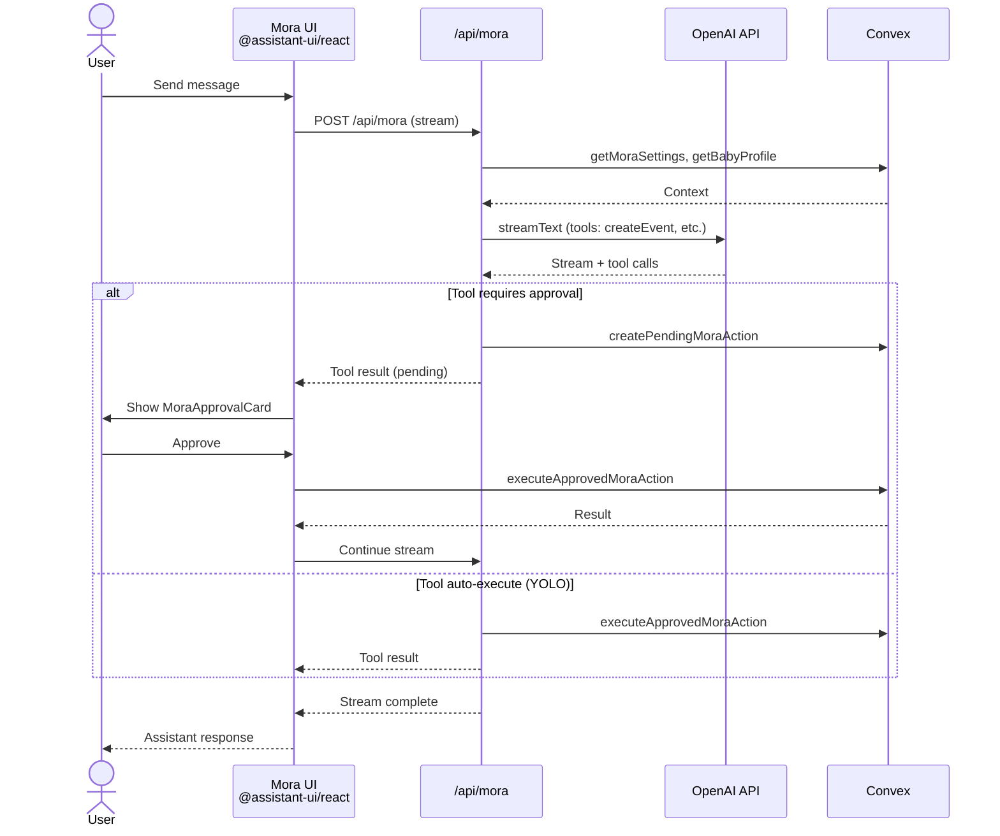
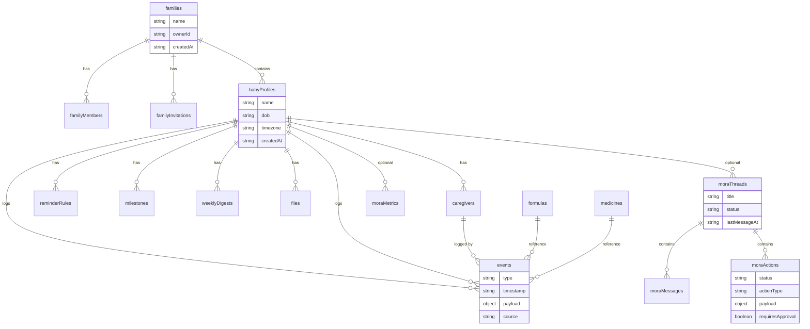
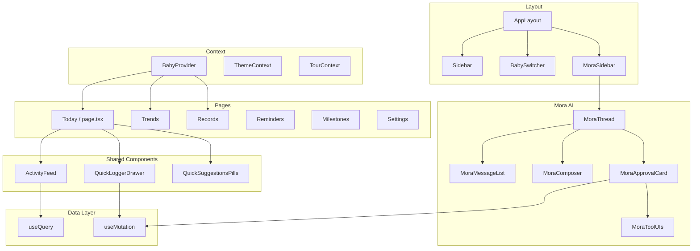
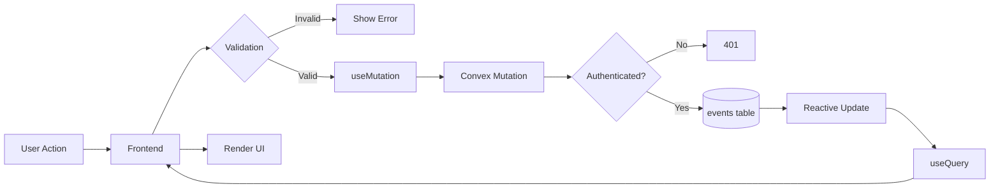
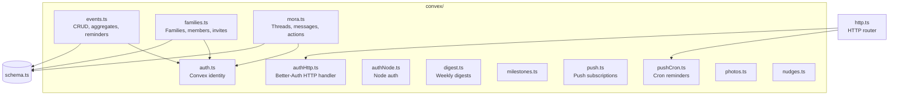
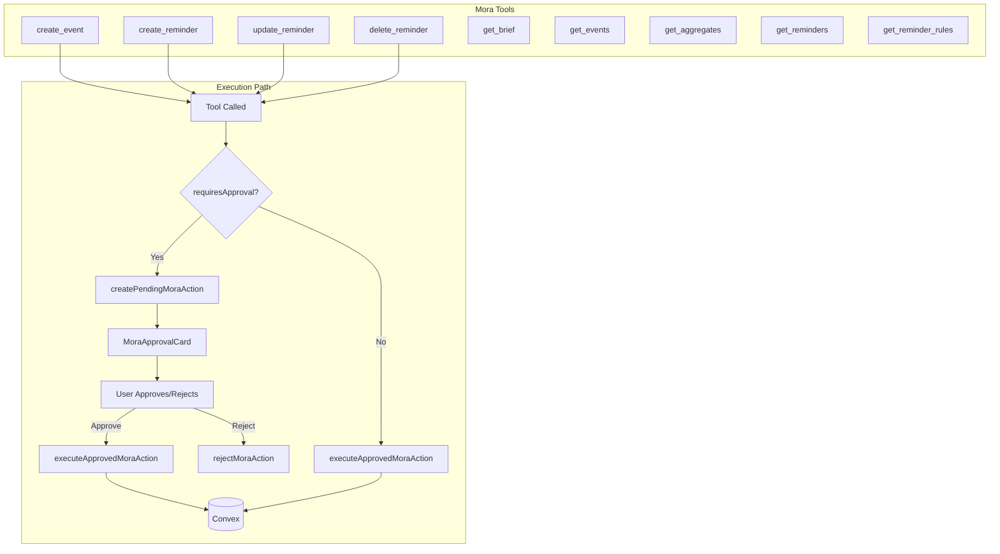

# Zen Nurture — Architecture Diagrams

This document describes the Zen Nurture architecture using code-based diagrams (Mermaid, PlantUML).

---

## 1. C4 Context Diagram

High-level system context: who uses the system and what external systems it integrates with.

---

## 2. System Architecture Diagram

Full stack with client, API, backend, and data layers.

---

## 3. Authentication Flow (Sequence Diagram)

How Better-Auth and Convex tokens are bridged.

---

## 4. Mora AI Flow (Sequence Diagram)

Mora chat with tool execution and approval flow.

---

## 5. Data Entity Relationship Diagram

Convex tables and their relationships.

---

## 6. Component Diagram (Frontend)

React app structure and key components.

---

## 7. Event Flow (Data Flow Diagram)

How events flow from user action to storage and display.

---

## 8. Convex Module Map

Backend modules and their responsibilities.

---

## 9. Mora Tool Execution Flow

Tools available to Mora and how they execute.

---

## References

- [Mermaid Documentation](https://mermaid.js.org/)
- [C4 Model](https://c4model.com/)
- [Convex Documentation](https://docs.convex.dev/)
- [Better-Auth](https://www.better-auth.com/)
